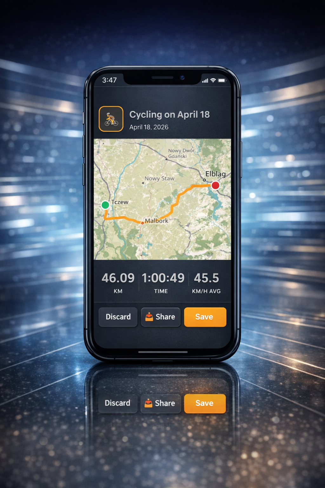

# 🗺️ MapYou - Fitness Tracker & Workout Map

> A full-featured **Progressive Web App** for tracking workouts, recording live GPS activities, planning routes and analysing weekly stats — all on an interactive map, right in your browser.

**[🚀 Live Demo → leszekm12.github.io/Mapty-App](https://leszekm12.github.io/Mapty-App/)**

---

## 📸 Preview

| Activity Summary | Share Image |
|--|-|
|||

---

## ✨ Features

### 🏋️ Workout Logging (Manual)
- Click anywhere on the map to log a workout at that location
- Supports **Running**, **Cycling** and **Walking**
- Running/Walking: distance, duration, pace (min/km), cadence
- Cycling: distance, duration, speed (km/h), elevation gain
- Each workout gets a **colour-coded pin** on the map with a popup
- Click a workout card to **fly to its location** on the map
- Delete any workout with the ✕ button

### 📍 Live GPS Tracker
- Real-time activity recording via the **Track** tab
- Draws your route on the map as you move
- Live stats overlay: distance, elapsed time, pace / speed
- **Pause & Resume** support — paused time is excluded from stats
- GPS filter to discard erroneous jumps (> 50 m between readings)
- On finish: activity summary modal with mini-map, stats, Discard / Share / Save
- Saved activities appear in **Activity History** with route replay on the map
- **Push notification** sent on save: *"🏃 Aktywność zakończona! — X km · Ymin"*

### 🗺️ Route Planner (A → B)
- Click two points on the map to plan a route
- Route calculated via **Mapbox Directions API** along real roads/paths
- Supports Running, Cycling and Walking profiles
- Displays total distance and estimated time
- Recalculates time instantly when you switch activity mode
- Route coords can be saved with a workout

### 📊 Weekly Stats
- **Stats tab** with animated SVG progress rings: km, time, workout count
- Weekly bar chart broken down by day and sport type
- Click any day bar to filter the workout list to that day
- Navigate back through previous weeks
- Customisable weekly goals (km, time, count) — persisted in localStorage
- Celebration animation when the km goal is reached

### 🔍 POI Search & Map
- Floating search bar on the Map tab
- Quick-filter buttons: 🛒 Store · 🚻 WC · 💊 Pharmacy · 🌳 Park · 📦 Paczkomat · 🍴 Restaurant · 🏧 ATM · 🏨 Hotel · ⛪ Church · ☕ Cafe · 🏥 Hospital
- Results shown as pins on the map; click to get route from your location

### 🌙 Settings
| Setting | Description |
|---|---|
| Night mode | Switches to dark CARTO map tiles + dark UI |
| Voice stats | Announces distance & pace every km via Web Speech API |
| Cluster markers | Groups nearby workout pins with Leaflet MarkerCluster |
| Share location | Sends a Google Maps link with your current coords |
| Clear all workouts | Wipes all saved data |
| Install app | PWA install prompt (Android/Chrome) |

### 📤 Share Image
- Generates a **800 × 1000 px PNG** ready for social media
- Includes real **OpenStreetMap tiles** as background (fetched dynamically)
- Route drawn on top with glow effect, start 🟢 / finish 🔴 dots
- Fallback to dark background if tiles fail to load

### 🔔 Push Notifications
- Web Push via **VAPID** + custom Node.js backend
- Triggers:
    - Workout saved (manual)
    - **Activity finished** (GPS tracker) — *new*
    - Workout deleted
    - Welcome back after 24 h absence
    - Ideal weather for a workout (Open-Meteo integration)
    - Arrived at route destination

### 🌤️ Weather Widget
- Current weather icon + sunset time in the header
- Powered by **Open-Meteo** (free, no API key)
- Auto-updates every 30 minutes

### 📱 PWA & Offline
- Full **Progressive Web App** with `manifest.json` and Service Worker
- Installable on Android (Chrome prompt) and iOS ("Add to Home Screen" banner)
- Offline mode detection with toast notification and badge
- Skeleton loading screen while map tiles initialise
- Map timeout with retry button

---

## 🛠️ Tech Stack

| Technology | Purpose |
|---|---|
| **TypeScript** | All source code, strict typing throughout |
| **Leaflet.js v1.6** | Interactive map rendering |
| **Leaflet MarkerCluster** | Grouping nearby workout markers |
| **Dexie.js (IndexedDB)** | Persistent storage for workouts & activities |
| **Mapbox Directions API** | A→B route calculation along real roads |
| **Open-Meteo API** | Free weather data (no key required) |
| **Web Push / VAPID** | Push notifications via custom backend |
| **Web Speech API** | Voice announcements during tracking |
| **Geolocation API** | Auto-centering + live GPS tracking |
| **Canvas API** | Share image generation with OSM tile background |
| **Service Worker** | Offline support + PWA lifecycle |
| **OpenStreetMap (HOT tiles)** | Map tiles (day mode) |
| **CARTO Dark** | Map tiles (night mode) |
| **Google Fonts — Manrope** | Typography |

---

## 🏗️ Project Structure

```
Mapty-App/
├── index.html                  # App shell, CDN imports, tab layout, tracker overlay
├── style.css                   # All styles — mobile-first, CSS custom properties
├── src/
│   ├── main.ts                 # App entry point — wires everything together
│   ├── config.ts               # Mapbox token, backend URL
│   ├── models/
│   │   └── Workout.ts          # Workout, Running, Cycling, Walking classes
│   ├── modules/
│   │   ├── ActivityView.ts     # Activity summary modal, share image generator, history panel
│   │   ├── BottomNav.ts        # 4-tab navigation controller
│   │   ├── MapView.ts          # Leaflet map init, tile switching, night mode
│   │   ├── OfflineDetector.ts  # Online/offline events, skeleton loader, retry
│   │   ├── PushNotifications.ts# VAPID push subscription + all push triggers
│   │   ├── RoutePlanner.ts     # A→B route planning via Mapbox Directions
│   │   ├── StatsPanel.ts       # Weekly stats rings, bar chart, goal editor
│   │   ├── Tracker.ts          # Live GPS tracker — start/pause/resume/stop
│   │   └── WeatherWidget.ts    # Open-Meteo fetch + DOM render
│   ├── types/
│   │   └── index.ts            # All shared interfaces and enums
│   └── utils/
│       ├── dom.ts              # qs / qid / qidSafe / show / hide helpers
│       └── geo.ts              # Haversine, OSM tile coords, week bounds
├── public/
│   ├── manifest.json           # PWA manifest
│   ├── sw.js                   # Service Worker (cache + offline)
│   ├── push-sw.js              # Push notification Service Worker
│   ├── icon-192.png
│   └── logo.png
└── dist/                       # Compiled JS (TypeScript output)
```

---

## ⚙️ Running Locally

```bash
# 1. Clone
git clone https://github.com/LeszekM12/Mapty-App.git
cd Mapty-App

# 2. Install dependencies (TypeScript compiler)
npm install

# 3. Compile TypeScript
npx tsc

# 4. Serve (HTTPS or localhost required for Geolocation + Push)
npx serve .
# or
python3 -m http.server 8080
```

> ⚠️ The **Geolocation API**, **Push Notifications** and **Service Worker** all require **HTTPS** or `localhost`. Opening `index.html` directly via `file://` will not work.

---

## 🚀 Deployment (GitHub Pages)

The app is deployed automatically from the `main` branch:

1. Compiled `dist/` is committed alongside source
2. GitHub Pages serves from root `/`
3. Live at **[leszekm12.github.io/Mapty-App](https://leszekm12.github.io/Mapty-App/)**

Push notifications require the **[mapty-backend](https://mapty-backend-lexb.onrender.com)** — a separate Node.js server hosted on Render that handles VAPID key management and `/push/subscribe`, `/push/send` endpoints.

---

## 📝 License

For learning and portfolio use only. Do not claim as your own or use for teaching.
