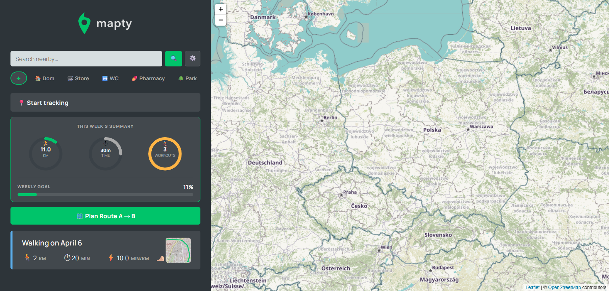
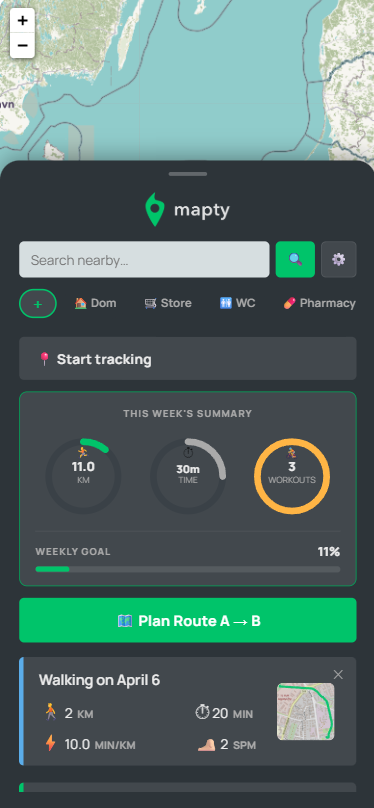

# 🗺️ Mapty - Workout Tracking App

A progressive web application for tracking running, cycling and walking workouts on an interactive map. Built with vanilla JavaScript, Leaflet.js and IndexedDB (Dexie.js).

---

>
> 
> 
> 
> 

---
## 📋 Table of Contents

1. [Features Overview](#features-overview)
2. [Workout Types](#workout-types)
3. [Map & Markers](#map--markers)
4. [Route Planning A → B](#route-planning-a--b)
5. [Live GPS Tracking](#live-gps-tracking)
6. [Weekly Statistics](#weekly-statistics)
7. [POI Search & Custom Filters](#poi-search--custom-filters)
8. [Settings](#settings)
9. [Offline Mode & Error Handling](#offline-mode--error-handling)
10. [Data Storage — IndexedDB](#data-storage--indexeddb)
11. [PWA & Installation](#pwa--installation)
12. [File Structure](#file-structure)
13. [Technologies Used](#technologies-used)

---

## ✨ Features Overview

| Feature | Description |
|---|---|
| Add workouts | Tap map to add running, cycling or walking workouts |
| Route planner | Plan A→B routes with walking/cycling/running profiles |
| Live tracking | Real-time GPS tracking with pace announcements |
| Weekly stats | SVG ring charts, day bars, weekly goal tracking |
| POI search | Search nearby places (stores, WC, pharmacy, etc.) |
| Custom pins | Save your own places (Home, Office, etc.) as filter buttons |
| Cluster markers | Group nearby workout markers when zoomed out |
| Offline mode | Full app works without internet; map shows offline badge |
| IndexedDB | All workout data stored in IndexedDB via Dexie.js |
| PWA | Installable, works offline, service worker |
| Night mode | Dark map tiles + dark UI |
| Voice stats | Text-to-speech announces distance and pace every km |

---

## 🏃 Workout Types

Three workout types are supported:

### Running
- Fields: Distance (km), Duration (min), Cadence (step/min)
- Displays: Pace (min/km), Cadence (spm)
- Card border: **green** (`#00c46a`)
- Popup marker: 🏃‍♂️

### Cycling
- Fields: Distance (km), Duration (min), Elevation Gain (m)
- Displays: Speed (km/h), Elevation (m)
- Card border: **amber** (`#ffb545`)
- Popup marker: 🚴‍♀️

### Walking
- Fields: Distance (km), Duration (min), Cadence (step/min)
- Displays: Pace (min/km), Cadence (spm)
- Card border: **blue** (`#5badea`)
- Popup marker: 🚶

### Adding a Workout
**Desktop:** Click any point on the map → form appears in sidebar → fill in fields → click ✓ Add Workout.

**Mobile:** Tap any point on the map → centred modal appears → fill in fields → tap ✓ Add Workout.

Distance and duration support half-steps (e.g. `6.5`, `2.5`).

### Workout Card
Each workout card shows:
- Title (type + date)
- Distance, Duration
- Type-specific stats (pace/cadence or speed/elevation)
- **Route thumbnail** — if the workout was created with an active A→B route, a small OSM map tile with the route polyline drawn on it appears in the top-right corner of the card
- Click to show marker and route on map; click again to deselect
- ✕ button to delete

---

## 🗺️ Map & Markers

### Tiles
- **Day mode:** OpenStreetMap HOT tiles
- **Night mode:** CartoDB Dark Matter tiles

### Marker Behaviour (default — Cluster OFF)
- All markers are **hidden by default** (`opacity: 0`, `pointer-events: none`)
- Clicking a workout card reveals **only that workout's marker** with popup
- Clicking the same card again hides the marker
- Clicking a different card switches to that marker

### Cluster Mode (optional — in Settings)
When **Cluster markers** is enabled:
- All markers are visible at all times
- At lower zoom levels, nearby markers group into a circular badge showing the count
- At higher zoom levels they spread into individual pins
- Clicking a card still centres the map and opens the popup

### Route Overlay
When a workout with a saved route is selected, the route is drawn as a dashed green polyline on the map.

---

## 🧭 Route Planning A → B

### How to Use
1. Tap **🗺️ Plan Route A → B**
2. Select activity mode: 🏃‍♂️ Running / 🚴‍♀️ Cycling / 🚶 Walking
3. Tap point A on the map
4. Tap point B on the map
5. Route is calculated and drawn

### Routing Profiles
- **Running / Walking** → OSRM `foot` profile (pavements, paths, not roads)
- **Cycling** → OSRM `bike` profile

### Result
- Displays distance and estimated time
- After route is drawn, you can tap the map to **add a workout** linked to that route
- The route thumbnail is saved with the workout

### Cancel
Tap **✕ Cancel route** to discard the route.

---

## 📍 Live GPS Tracking

### Starting Tracking
Tap **📍 Start tracking** to begin real-time GPS tracking.

### Features
- Pulsing blue dot shows current position
- Map auto-centres on position (lazy — stops if user touches map)
- Distance accumulation shown live
- **Screen Wake Lock** badge "SCREEN ON" keeps screen active during tracking

### Voice Stats
If **Voice stats** is enabled in Settings, the app announces distance and pace at every 1 km milestone via Text-to-Speech.

### Arrival Detection
When navigating a planned A→B route, the app detects arrival at the destination (within 20 m, 3 consecutive fixes) and shows a toast notification.

---

## 📊 Weekly Statistics

### Summary Panel
Tap **THIS WEEK'S SUMMARY** to expand:
- Three animated SVG ring charts: KM / TIME / WORKOUTS
- Weekly goal progress bar (%)
- Goal celebration toast 🏆 when 100% reached

### Weekly Activity Detail
- Bar chart showing activity per day (Mon–Sun)
- Colour-coded: green = running, amber = cycling, blue = walking
- Navigate between weeks with ‹ › buttons
- Tap a day bar to filter the workout list to that day

### Weekly Goals
Set your own targets:
- Distance target (km)
- Time target (min)
- Workouts target (count per week)

### Workout List Filtering
The workout list below automatically filters to show only workouts from the selected week.

---

## 🔍 POI Search & Custom Filters

### Search Bar
Type any query and press 🔍 or Enter to search nearby places using the Nominatim API. Results show name, address, and distance. Clicking a result shows it on the map with a **"Set as route A →"** button.

### Autocomplete
After typing 2+ characters, suggestions appear automatically (350 ms debounce).

### Default Filter Buttons
Quick access to: Store, WC, Pharmacy, Park, Paczkomat, Restaurant, ATM, Hotel, Church, Cafe, Hospital.

### Custom Pinned Filters
Add your own permanent filter buttons (e.g. Home, Office):

1. Tap **＋** (first button in filter row)
2. **First tap a spot on the map** to set the location (the modal shows a hint: "Tap directly on the map")
3. Enter a name (max 30 characters)
4. Choose an emoji from the grid or type your own
5. Tap **Save**

The new button appears at the start of the filter row (newest first). Tapping it:
- Shows the saved location on the map with a custom emoji marker
- Displays a result card with address, distance, and "Set as route A →"

**Delete:** Long-press (600 ms) on mobile or right-click on desktop → confirmation prompt.

Saved in `localStorage` as `customFilters`.

---

## ⚙️ Settings

Open with the ⚙️ gear icon in the top right.

| Setting | Description |
|---|---|
| Share my location | Copies a Google Maps link to your current position |
| Night mode | Toggles dark UI + dark map tiles |
| Voice stats | Enables/disables km-milestone announcements |
| Cluster markers | Groups nearby workout markers (toggle, off by default) |
| Clear all workouts | Deletes all workouts from IndexedDB |
| Install app | Prompts PWA install (shown only when available) |

---

## 📴 Offline Mode & Error Handling

### Online Detector
The app listens to `window.online` / `window.offline` events in real time.

### When Internet is Lost
- A **toast notification** slides up in the centre of the map for 3 seconds then fades away
- A persistent **"Offline" badge** appears in the top-right corner of the map
- The sidebar (workouts list, statistics, route planner UI) **remains fully accessible**
- Only the map tiles and routing are unavailable

### When Internet Returns
The badge disappears automatically. If the map was never loaded, it starts loading.

### Map Loading Skeleton
While the map loads:
- A dark skeleton overlay with a **green spinning loader** covers only the map area
- The sidebar is always visible and usable

### Map Timeout (10 seconds)
If the map tiles have not loaded after 10 seconds:
- A message appears: *"Map is loading longer than usual…"*
- A **↺ Retry** button lets the user re-request geolocation and reinitialise Leaflet
- After 2 failed retries, the user is asked: *"Could not connect to the map. Switch to offline mode?"*

### Service Worker Auto-Update
When a new service worker is detected, it activates immediately and the app reloads to pick up fresh assets — the map never gets stuck on stale cache.

---

## 💾 Data Storage — IndexedDB

All workout data is stored in **IndexedDB** via [Dexie.js](https://dexie.org/). Settings and preferences remain in `localStorage`.

### Database Schema (`db.js`)
```
Database: mapty
Table: workouts
  id           – primary key (string timestamp)
  type         – 'running' | 'cycling' | 'walking'
  date         – ISO 8601 string (indexed for week queries)
  distance     – km
  duration     – minutes
  cadence      – step/min (running/walking)
  pace         – min/km (running/walking)
  elevGain     – metres (cycling)
  elevationGain– metres (cycling, alias)
  speed        – km/h (cycling)
  coords       – [lat, lng]
  description  – "Running on April 6"
  routeCoords  – array of [lat, lng] points or null
```

### Automatic Migration
On first launch after updating from the old version, `migrateLocalStorageToIndexedDB()` runs automatically:
1. Reads `localStorage.workouts`
2. Parses and normalises each workout
3. Writes all records with `bulkAdd()`
4. Removes `localStorage.workouts` on success
5. Safe: skips if IndexedDB already has data

### API Functions (available globally from `db.js`)
```js
loadWorkoutsFromDB()          // → Promise<Workout[]>  (newest first)
saveWorkoutToDB(workout)      // → Promise<id>         (upsert)
deleteWorkoutFromDB(id)       // → Promise<void>
clearAllWorkoutsFromDB()      // → Promise<void>
loadWorkoutsForWeek(mon, sun) // → Promise<Workout[]>  (range query)
```

---

## 📱 PWA & Installation

### iOS
A banner appears after 2.5 seconds on first visit:
*"Tap Share and 'Add to Home Screen'"*

Dismissed state saved in `localStorage.iosBannerDismissed`.

### Android / Desktop
When the browser fires `beforeinstallprompt`, the **"Install app"** option appears in Settings.

### Service Worker (`sw.js`)
- Caches app shell for offline use
- On update: sends `SKIP_WAITING`, app reloads automatically

---

## 📁 File Structure

```
mapty/
├── index.html        — App shell, HTML structure
├── script.js         — Main application logic (App class)
├── db.js             — IndexedDB module (Dexie.js)
├── style.css         — All styles
├── sw.js             — Service worker
├── manifest.json     — PWA manifest
├── icon-192.png      — App icon
└── logo.png          — Mapty logo
```

---

## 🛠️ Technologies Used

| Technology | Purpose |
|---|---|
| Vanilla JavaScript (ES2022) | Application logic, classes, private fields |
| [Leaflet.js 1.6](https://leafletjs.com/) | Interactive map |
| [Leaflet Routing Machine 3.2](https://www.lrmproject.com/) | A→B route planning |
| [Leaflet.markercluster 1.5](https://github.com/Leaflet/Leaflet.markercluster) | Marker clustering |
| [Dexie.js 3](https://dexie.org/) | IndexedDB wrapper |
| [OSRM](https://project-osrm.org/) | Open-source routing engine (foot + bike profiles) |
| [Nominatim](https://nominatim.org/) | POI search & reverse geocoding |
| OpenStreetMap | Map tiles (day) |
| CartoDB | Map tiles (night) |
| Web Speech API | Voice stats (Text-to-Speech) |
| Screen Wake Lock API | Keep screen on during tracking |
| Service Worker + Cache API | Offline support, PWA |
| IndexedDB | Persistent workout storage |
| localStorage | Settings, preferences, custom filters |

---

## 🚀 Getting Started

1. Clone or download the repository
2. Serve with any static server (e.g. VS Code Live Server, `npx serve .`)
3. Grant location permission when prompted
4. Tap the map to add your first workout

> **Note:** The app requires a browser that supports geolocation, IndexedDB and Service Workers (all modern browsers). HTTPS or localhost is required for geolocation and service workers.

---

*Built as a learning project — extended from the original Mapty course project by Jonas Schmedtmann.*
